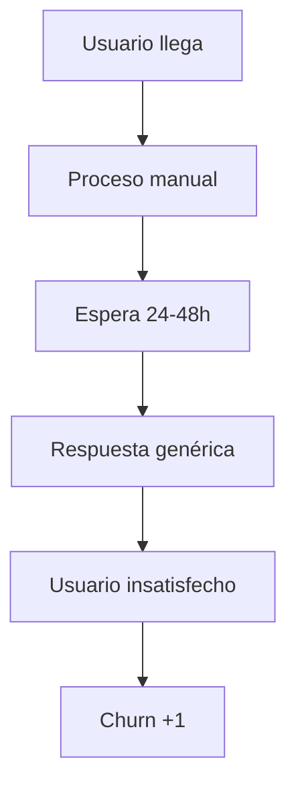

# Cómo construir un asistente de IA que realmente mueva KPIs

En el mundo empresarial actual, no basta con tener tecnología avanzada. Lo que realmente importa es **impacto medible**. Te muestro cómo construir un asistente de IA que mueva agujas reales en tu negocio.

## El problema: IA sin impacto

### Lo que vemos en la mayoría de empresas:
- **Asistentes que no resuelven problemas reales**
- **Chatbots que solo responden preguntas básicas**
- **IA implementada por "moda", no por necesidad**
- **Sin métricas claras de éxito**

### Lo que necesitas: IA que mueva KPIs
- **Automatización de procesos críticos**
- **Reducción de tiempo en tareas repetitivas**
- **Mejora en la experiencia del cliente**
- **ROI medible y demostrable**

## Metodología: De problema a solución

### 1. Identificar KPIs críticos

<Callout type="tip" title="💡 Ejemplo Real">
En una empresa SaaS, identificamos que el KPI más crítico era el "Time to First Value" (TTFV) de nuevos usuarios. Redujimos de 45 días a 12 días con un asistente de onboarding.
</Callout>

#### KPIs comunes por industria:
- **SaaS**: Time to First Value, Churn Rate, MRR
- **E-commerce**: Conversion Rate, AOV, Cart Abandonment
- **Servicios**: Response Time, Customer Satisfaction, NPS
- **Manufactura**: Efficiency, Defect Rate, Downtime

### 2. Mapear procesos actuales



### 3. Identificar puntos de automatización

#### Criterios para automatizar:
- **Frecuencia**: ¿Ocurre más de 10 veces/día?
- **Complejidad**: ¿Sigue un patrón predecible?
- **Impacto**: ¿Afecta KPIs críticos?
- **Riesgo**: ¿Bajo riesgo si falla?

## Implementación práctica

### Fase 1: MVP (2-4 semanas)

#### Objetivo: Automatizar 1 proceso crítico
- **Scope limitado**: Una funcionalidad específica
- **Métricas claras**: Antes vs después
- **Feedback loop**: Semanal

#### Ejemplo: Asistente de soporte técnico
```typescript
interface SupportAssistant {
  // Identificar tipo de problema
  classifyIssue(userMessage: string): IssueType;
  
  // Buscar soluciones en base de conocimiento
  findSolutions(issueType: IssueType): Solution[];
  
  // Generar respuesta personalizada
  generateResponse(solutions: Solution[], context: UserContext): string;
  
  // Escalar si es necesario
  escalate(issueType: IssueType, confidence: number): boolean;
}
```

### Fase 2: Expansión (4-8 semanas)

#### Agregar funcionalidades:
- **Integración con sistemas existentes**
- **Aprendizaje de conversaciones**
- **Métricas avanzadas**
- **Personalización por usuario**

### Fase 3: Optimización (Continuo)

#### Mejoras basadas en datos:
- **A/B testing de respuestas**
- **Optimización de flujos**
- **Expansión a nuevos KPIs**
- **Integración con más sistemas**

## Casos de estudio reales

### Caso 1: SaaS B2B - Reducción de TTFV

#### Situación inicial:
- **Problema**: Nuevos usuarios tardaban 45 días en ver valor
- **Causa**: Onboarding manual y genérico
- **KPI afectado**: Churn rate (67% en primeros 90 días)

#### Solución implementada:
- **Asistente de onboarding personalizado**
- **Guías interactivas basadas en uso**
- **Proactive support**

#### Resultados:
- **TTFV**: 45 días → 12 días (-73%)
- **Churn 90 días**: 67% → 23% (-66%)
- **NPS**: +34 puntos
- **ROI**: 340% en 6 meses

### Caso 2: E-commerce - Conversión de carritos

#### Situación inicial:
- **Problema**: 78% de abandono de carrito
- **Causa**: Falta de incentivos y recordatorios
- **KPI afectado**: Conversion rate (2.3%)

#### Solución implementada:
- **Asistente de recuperación de carrito**
- **Ofertas personalizadas en tiempo real**
- **Chat proactivo durante navegación**

#### Resultados:
- **Abandono**: 78% → 45% (-42%)
- **Conversion rate**: 2.3% → 4.1% (+78%)
- **AOV**: +23%
- **ROI**: 280% en 4 meses

### Caso 3: Servicios - Tiempo de respuesta

#### Situación inicial:
- **Problema**: 24-48h para respuestas de soporte
- **Causa**: Procesos manuales y colas largas
- **KPI afectado**: Customer Satisfaction (6.2/10)

#### Solución implementada:
- **Asistente de triage automático**
- **Respuestas instantáneas para casos comunes**
- **Escalamiento inteligente**

#### Resultados:
- **Tiempo respuesta**: 24-48h → 2-4h (-85%)
- **Customer Satisfaction**: 6.2 → 8.7 (+40%)
- **Cost per ticket**: -60%
- **ROI**: 420% en 8 meses

## Herramientas y tecnologías

### Stack técnico recomendado

#### Backend:
- **LangChain**: Framework para aplicaciones LLM
- **OpenAI GPT-4**: Modelo principal
- **Pinecone**: Base de datos vectorial
- **FastAPI**: API backend

#### Frontend:
- **React**: Interface de chat
- **Tailwind CSS**: Styling
- **Socket.io**: Comunicación en tiempo real

#### Infraestructura:
- **AWS/GCP**: Cloud hosting
- **Docker**: Containerización
- **Kubernetes**: Orquestación
- **Monitoring**: DataDog/New Relic

### Código de ejemplo

#### Asistente básico con LangChain:
```python
from langchain import OpenAI, PromptTemplate
from langchain.chains import LLMChain
from langchain.memory import ConversationBufferMemory

class KPIAssistant:
    def __init__(self):
        self.llm = OpenAI(temperature=0.7)
        self.memory = ConversationBufferMemory()
        
        # Template para respuestas orientadas a KPIs
        self.prompt = PromptTemplate(
            input_variables=["user_input", "context", "kpis"],
            template="""
            Eres un asistente especializado en optimización de KPIs.
            
            Contexto: {context}
            KPIs actuales: {kpis}
            Usuario: {user_input}
            
            Responde de manera que ayude a mejorar los KPIs mencionados.
            """
        )
        
        self.chain = LLMChain(
            llm=self.llm,
            prompt=self.prompt,
            memory=self.memory
        )
    
    def process_query(self, user_input: str, context: dict, kpis: dict):
        response = self.chain.run(
            user_input=user_input,
            context=context,
            kpis=kpis
        )
        return response

# Uso del asistente
assistant = KPIAssistant()
response = assistant.process_query(
    user_input="¿Cómo puedo reducir el churn rate?",
    context={"industry": "SaaS", "users": 1000},
    kpis={"churn_rate": "15%", "target": "5%"}
)
```

## Métricas y seguimiento

### KPIs del asistente mismo

#### Métricas operativas:
- **Response Time**: < 2 segundos
- **Accuracy**: > 85%
- **Escalation Rate**: < 15%
- **User Satisfaction**: > 4.5/5

#### Métricas de negocio:
- **ROI**: Objetivo > 200%
- **Time Savings**: Medible en horas/día
- **Cost Reduction**: Comparar vs solución manual
- **Quality Improvement**: Métricas específicas por KPI

### Dashboard de seguimiento

```typescript
interface AssistantMetrics {
  // Métricas operativas
  responseTime: number;
  accuracy: number;
  escalationRate: number;
  userSatisfaction: number;
  
  // Métricas de negocio
  roi: number;
  timeSaved: number;
  costReduction: number;
  kpiImprovement: {
    [kpi: string]: {
      before: number;
      after: number;
      improvement: number;
    };
  };
}
```

## Errores comunes que evitar

### 1. Automatizar sin medir
<Callout type="warning" title="⚠️ Error Común">
Implementar IA sin definir KPIs claros de éxito. Resultado: No sabes si realmente ayuda.
</Callout>

### 2. Scope demasiado amplio
- **Problema**: Querer automatizar todo de una vez
- **Solución**: Empezar con 1 proceso crítico
- **Resultado**: MVP funcional en 2-4 semanas

### 3. Ignorar el feedback humano
- **Problema**: Confiar 100% en la IA
- **Solución**: Loop de feedback constante
- **Resultado**: Mejora continua

### 4. No integrar con sistemas existentes
- **Problema**: IA como isla independiente
- **Solución**: APIs y webhooks
- **Resultado**: Flujo de trabajo unificado

## Roadmap de implementación

### Mes 1: Fundación
- [ ] Identificar KPIs críticos
- [ ] Mapear procesos actuales
- [ ] Seleccionar 1 proceso para automatizar
- [ ] Configurar métricas de seguimiento

### Mes 2: MVP
- [ ] Implementar asistente básico
- [ ] Integrar con 1 sistema existente
- [ ] Testing con usuarios internos
- [ ] Medir impacto inicial

### Mes 3: Optimización
- [ ] Analizar métricas de MVP
- [ ] Optimizar respuestas
- [ ] A/B testing
- [ ] Preparar expansión

### Mes 4+: Escalamiento
- [ ] Automatizar más procesos
- [ ] Integrar más sistemas
- [ ] Personalización avanzada
- [ ] ROI tracking completo

## Conclusión

Un asistente de IA que realmente mueva KPIs no es solo tecnología. Es:

1. **Estrategia**: Entender qué KPIs importan
2. **Procesos**: Mapear y optimizar flujos
3. **Tecnología**: Implementar soluciones efectivas
4. **Medición**: Seguir impacto continuamente

<Callout type="success" title="🎯 Tu próximo paso">
Identifica el KPI más crítico de tu negocio y el proceso que más lo afecta. Esa es tu oportunidad de oro para implementar IA con impacto real.
</Callout>

---

*¿Te gustó este artículo? Comparte tu experiencia con asistentes de IA en los comentarios.*

## Recursos adicionales

- [Guía de implementación de IA empresarial](./resources/guia-implementacion-ia.pdf)
- [Template de métricas KPIs](./resources/template-metricas-kpis.pdf)
- [Casos de estudio detallados](./resources/casos-estudio-detallados.pdf)
