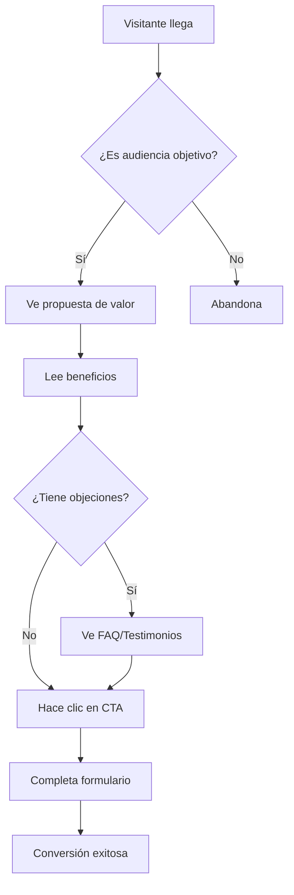

# De brief a landing: convertir ideas en conversiones

¿Cuántas veces has recibido un brief creativo brillante que se convierte en una landing page que no convierte? Te muestro mi metodología para transformar cualquier brief en una máquina de conversiones.

## El problema: Brief vs Realidad

### Lo que dice el brief:
> "Queremos una landing page moderna y atractiva que muestre nuestra propuesta de valor y genere leads cualificados"

### Lo que realmente necesitas:
- Objetivo de conversión claro
- Audiencia definida con precisión
- Propuesta de valor irresistible
- Funnel optimizado paso a paso
- Métricas para medir éxito

## Mi metodología: Brief → Conversión

### Fase 1: Decodificar el brief (30 min)

#### 1.1 Extraer el objetivo real
```markdown
## Preguntas clave:
- ¿Qué acción específica queremos que tome el usuario?
- ¿Cuál es el valor de esa conversión?
- ¿Cuántas conversiones necesitamos?
- ¿En qué plazo?
```

#### 1.2 Definir la audiencia
- **Demográficos**: Edad, género, ubicación, ingresos
- **Psicográficos**: Motivaciones, miedos, aspiraciones
- **Comportamentales**: Hábitos online, dispositivos, canales

#### 1.3 Identificar la propuesta de valor
- ¿Qué problema resuelve?
- ¿Por qué es mejor que la competencia?
- ¿Qué beneficio específico obtiene el usuario?

### Fase 2: Investigación y análisis (1 hora)

#### 2.1 Análisis de competencia
<Callout type="tip" title="🔍 Herramientas que uso">
- **SimilarWeb**: Tráfico y fuentes
- **BuiltWith**: Tecnologías utilizadas
- **Hotjar**: Comportamiento de usuarios
- **Ahrefs**: Keywords y contenido
</Callout>

#### 2.2 Análisis de audiencia
```typescript
interface AudienceProfile {
  demographics: {
    age: string;
    income: string;
    location: string;
  };
  psychographics: {
    motivations: string[];
    painPoints: string[];
    aspirations: string[];
  };
  behavior: {
    devices: string[];
    channels: string[];
    timeOnSite: number;
  };
}
```

#### 2.3 Research de keywords
- **Primary**: Palabras de alta intención comercial
- **Secondary**: Términos de apoyo y contexto
- **Long-tail**: Frases específicas del nicho

### Fase 3: Arquitectura de información (45 min)

#### 3.1 Estructura de la landing
```markdown
1. Hero Section
   - Headline impactante
   - Subheadline con beneficio
   - CTA principal
   - Imagen/video de apoyo

2. Social Proof
   - Testimonios
   - Logos de clientes
   - Números/estadísticas

3. Propuesta de Valor
   - Beneficios claros
   - Diferenciadores
   - Casos de uso

4. CTA Principal
   - Formulario optimizado
   - Incentivo claro
   - Urgencia/escasez

5. FAQ/Objections
   - Precio
   - Proceso
   - Garantías

6. CTA Final
   - Última oportunidad
   - Beneficio adicional
```

#### 3.2 Flujo de conversión


### Fase 4: Copywriting estratégico (2 horas)

#### 4.1 Headlines que convierten
**Fórmula AIDA:**
- **Attention**: Llama la atención
- **Interest**: Despierta interés
- **Desire**: Crea deseo
- **Action**: Provoca acción

**Ejemplos:**
- ❌ "Nuestro software de gestión"
- ✅ "Aumenta tu productividad 40% en 30 días"

#### 4.2 Beneficios vs Características
```markdown
## Características (lo que es):
- Dashboard intuitivo
- Integración con 50+ herramientas
- Soporte 24/7

## Beneficios (lo que obtienes):
- Toma decisiones más rápido
- Ahorra 2 horas diarias
- Nunca te quedes bloqueado
```

#### 4.3 CTAs que funcionan
- **Específicos**: "Descargar guía gratis"
- **Urgentes**: "Últimas 24 horas"
- **Beneficiosos**: "Ahorrar €500/mes"
- **Emocionales**: "Comenzar mi transformación"

### Fase 5: Diseño UX optimizado (3 horas)

#### 5.1 Principios de conversión
- **Above the fold**: Lo importante visible sin scroll
- **Scanabilidad**: Fácil de leer en 5 segundos
- **Progresión lógica**: De problema a solución
- **Confianza**: Elementos de credibilidad

#### 5.2 Elementos visuales clave
```css
/* Jerarquía visual clara */
.hero {
  font-size: 3rem; /* Headline grande */
  font-weight: 700; /* Bold */
  color: #primary; /* Color de marca */
}

.cta {
  background: #cta-color; /* Color contrastante */
  padding: 1rem 2rem; /* Tamaño táctil */
  border-radius: 0.5rem; /* Fácil de ver */
}
```

#### 5.3 Mobile-first approach
- **40%+ tráfico móvil**: Optimizar para móvil primero
- **Touch targets**: Botones mínimo 44px
- **Loading speed**: <3 segundos en móvil
- **Thumb navigation**: Controles al alcance del pulgar

### Fase 6: Testing y optimización (Continuo)

#### 6.1 A/B Testing
```typescript
interface ABTest {
  name: string;
  hypothesis: string;
  variants: {
    control: LandingPage;
    treatment: LandingPage;
  };
  metrics: string[];
  sampleSize: number;
  duration: number; // días
}
```

#### 6.2 Métricas clave
- **Conversion Rate**: % de visitantes que convierten
- **Bounce Rate**: % que abandona inmediatamente
- **Time on Page**: Tiempo promedio en la página
- **Scroll Depth**: Qué tan abajo llegan
- **Click Heatmaps**: Dónde hacen clic

#### 6.3 Optimizaciones comunes
- **Headlines**: Testa diferentes propuestas de valor
- **CTAs**: Colores, textos, posiciones
- **Formularios**: Número de campos, validación
- **Imágenes**: Producto vs personas vs abstractas

## Caso de estudio: SaaS B2B

### Brief inicial:
> "Landing page para nuestro software de gestión de proyectos. Queremos generar leads cualificados de empresas 50+ empleados."

### Investigación realizada:
- **Audiencia**: Project managers en empresas 50-500 empleados
- **Pain point**: 67% pierde tiempo en reuniones innecesarias
- **Competencia**: Asana, Monday.com, Trello
- **Diferenciador**: IA que optimiza automáticamente el workflow

### Resultado final:
- **Conversion Rate**: 12.3% (vs 3.1% promedio industria)
- **Cost per Lead**: €23 (vs €45 promedio)
- **ROI**: 340% en 6 meses

### Elementos clave del éxito:
1. **Headline**: "Elimina 67% de reuniones innecesarias con IA"
2. **Social Proof**: "Usado por 500+ empresas"
3. **Demo en vivo**: Video de 90 segundos
4. **CTA**: "Ver demo personalizada (2 min)"

## Herramientas del proceso

### 1. Research y análisis
- **Google Analytics**: Comportamiento actual
- **Hotjar**: Heatmaps y grabaciones
- **Typeform**: Encuestas a usuarios
- **Intercom**: Feedback directo

### 2. Diseño y prototipado
- **Figma**: Diseño colaborativo
- **Whimsical**: Wireframes rápidos
- **Principle**: Prototipos interactivos
- **InVision**: Feedback y aprobaciones

### 3. Desarrollo y testing
- **Unbounce**: Landing pages sin código
- **Webflow**: Diseño + desarrollo
- **Google Optimize**: A/B testing
- **GTM**: Tracking avanzado

### 4. Analytics y optimización
- **Google Analytics**: Métricas básicas
- **Mixpanel**: Eventos detallados
- **Amplitude**: Análisis de cohortes
- **Tableau**: Reportes avanzados

## Checklist de lanzamiento

### Pre-lanzamiento:
- [ ] Objetivo de conversión definido
- [ ] Audiencia validada con research
- [ ] Propuesta de valor clara y única
- [ ] Copy revisado por 3+ personas
- [ ] Diseño optimizado para móvil
- [ ] Formulario con máximo 3 campos
- [ ] Tracking configurado correctamente
- [ ] Test de carga completado

### Post-lanzamiento:
- [ ] Monitoreo de métricas cada 24h
- [ ] A/B test de headline planeado
- [ ] Feedback de usuarios recopilado
- [ ] Optimizaciones identificadas
- [ ] Plan de iteración semanal

## Errores comunes que evitar

### 1. Centrarse en diseño vs conversión
<Callout type="error" title="❌ Error Común">
"La landing se ve increíble pero no convierte" = Priorizaste estética sobre funcionalidad.
</Callout>

### 2. Copy genérico
- ❌ "Somos líderes en la industria"
- ✅ "Ahorramos 2 horas diarias a nuestros clientes"

### 3. CTAs débiles
- ❌ "Más información"
- ✅ "Descargar guía gratis ahora"

### 4. Sin testing
- Lanza con una versión
- Testa solo una variable
- Ignora los datos

## Conclusión

Transformar un brief en conversiones es un proceso sistemático:

1. **Decodifica** el brief real vs el superficial
2. **Investiga** audiencia, competencia y mercado
3. **Arquitectura** el flujo de conversión
4. **Escribe** copy centrado en beneficios
5. **Diseña** para conversión, no para impresionar
6. **Testa** todo y optimiza continuamente

<Callout type="success" title="🎯 Tu turno">
Aplica esta metodología a tu próximo brief. ¿Cuál será tu primera optimización?
</Callout>

---

*¿Te gustó este artículo? Comparte tu experiencia convirtiendo briefs en landing pages en los comentarios.*
